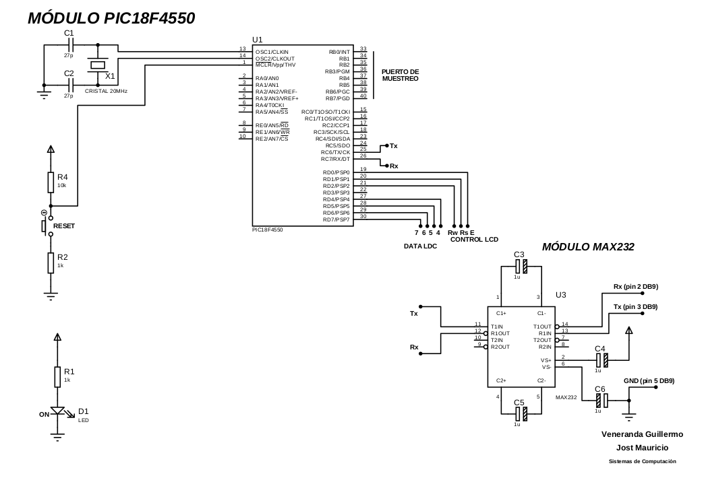
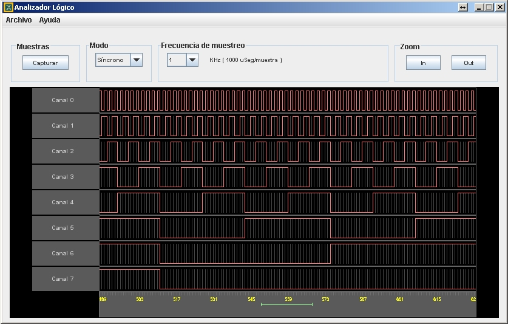

# README

This is a low cost logic analyzer project. 

## Layers

The project is made of an embedded system (based on a PIC uC) and a GUI application running on a standard Windows PC. 

### Embedded system (uC)

#### Hardware

The lower level module is implemented using a `PIC uC` based circuit.

The sources of the PCB (printed circuit board) can be found [here](logic-analyzer/docs/sources/pcb-sources).

#### Firmware (uC)

The firmware written in the uC ROM is coded in plain `C` language and can be found [here](logic-analyzer/uc/).

Note that the embedded system does not necessarily require the GUI, as it can be controlled via serial port (RS232) via commands. See the demo video.

### GUI (PC)

The graphical interface is implemented using `Java AWT`.

The `netbeans` Java project can be found [here](logic-analyzer/gui/).

## Documentation 

Find here more complete [documentation](logic-analyzer/docs/).

Find here a [demo video](https://www.youtube.com/watch?v=hvg7bHg8U7Q) in YouTube.

